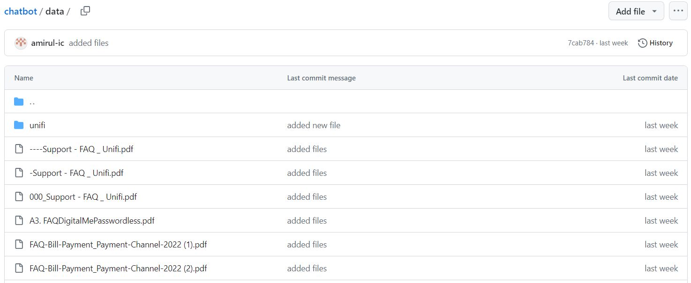

# Chat with FAQ Section

This objective is to create a chatbot using a custom data source and GPT-3.5 engine.     

Why custom data source?
* Relevancy of context  
* Information timeliness

In this demo app, this app chat with the Unifi Home FAQ document retrieved from the [website](https://unifi.com.my/support/faq):  Click [here](https://faq-chatbot.streamlit.app/) to access the app.

| FAQ Document|Chat GPT | App - Custom Data Source |
| ----------  |---------|--------------------------|
| Content     |Content  |Content Cell              |

The app can also be extended to personal book collections, enterprise knowledge banks, etc by replacing the documents in the 'data' folders accordingly.  

The code used is based on the tutorial [here](https://blog.streamlit.io/build-a-chatbot-with-custom-data-sources-powered-by-llamaindex/).
