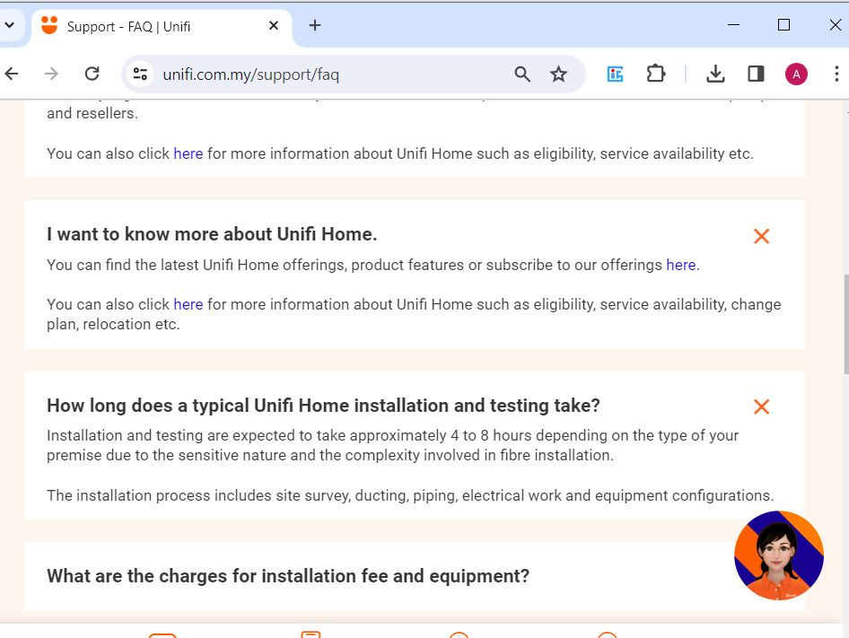

# Chat with FAQ Section

This objective is to create a chatbot using a **custom data source** and GPT-3.5 engine.     

Why custom data source?
* Relevancy of context  
* Information timeliness

In this demo app, this app chat with the Unifi Home FAQ document retrieved from the [website](https://unifi.com.my/support/faq): 
 
 

<u>Comparison</u> of responses_

| Official FAQ Document|Chat GPT | [App](https://faq-chatbot.streamlit.app/) - Custom Data Source |
| ----------  |---------|--------------------------|
|      |  |            |

 

Click [here](https://faq-chatbot.streamlit.app/) to access the app.

The app can also be extended to personal book collections, enterprise knowledge banks, etc by replacing the documents in the 'data' folders accordingly.  
 
 
 
 
**Reference**  
The code used is based on the tutorial [here](https://blog.streamlit.io/build-a-chatbot-with-custom-data-sources-powered-by-llamaindex/).
